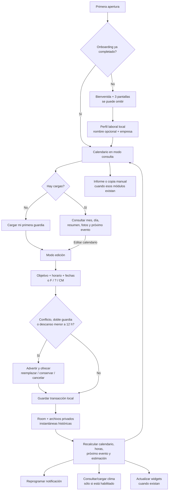
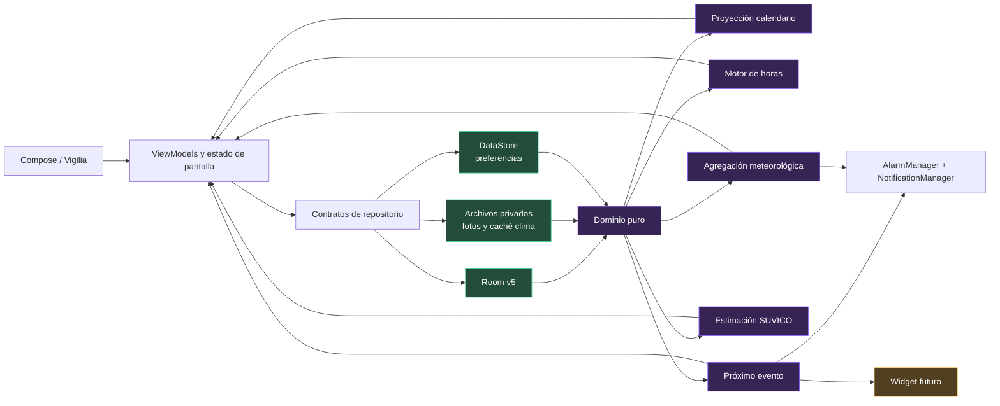
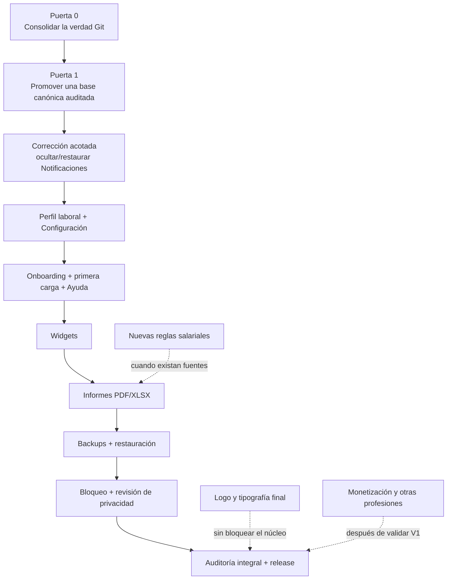

# MiGuardia — prompt maestro de pausa, revisión y reanudación

> Reanudación auditada el 17 de agosto de 2026: este documento conserva la fotografía de pausa y sus instrucciones. La evidencia actual de la Puerta 0 está en `docs/audits/2026-08-17-puerta-0-consolidacion.md`. Cuando una descripción histórica contradiga esa auditoría, prevalece la evidencia nueva.

> Cierre posterior del 18 de agosto de 2026: en la instantánea de promoción, `main`, `origin/main`, `codex/main-3` y `origin/codex/main-3` quedaron alineadas en `e3caf6f4acba8af8a1ff27620b7c8c99a4ff176f`. Este documento conserva la fotografía previa y no debe usarse para repetir la promoción. El estado canónico vigente está en `docs/audits/2026-08-18-base-canonica.md`.

> Documento de continuidad integral
>
> Fotografía auditada: 17 de agosto de 2026
>
> Propósito: conservar el corazón del producto, explicar con precisión dónde está el proyecto, separar lo integrado de lo pendiente y permitir que MAIN reanude el trabajo sin reconstruir esta historia desde conversaciones dispersas.

---

## 0. Cómo usar este documento

Este documento puede entregarse completo a una nueva tarea MAIN o usarse como guía de auditoría por la MAIN vigente. No reemplaza `AGENTS.md` ni `docs/PROMPT_MAESTRO_MAIN.md`: los conecta con el estado real de Git y con las dependencias que se agregaron durante el desarrollo.

Quien reciba este prompt debe:

1. leer `AGENTS.md` completo;
2. leer `docs/PROMPT_MAESTRO_MAIN.md` completo desde la línea de integración más avanzada;
3. leer este documento completo;
4. verificar nuevamente Git, worktrees, archivos no rastreados, compilación y dispositivo antes de actuar;
5. distinguir siempre entre decisión de producto, código implementado, integración en una rama, publicación en `main` y verificación física;
6. no borrar, integrar, confirmar ni publicar nada sin revisar primero el estado real y obtener la autorización que corresponda de Joa.

La fotografía técnica de este documento es verificable pero no eterna. Si Git cambió después del 17 de agosto de 2026, el estado actual prevalece y este archivo funciona como punto de comparación.

---

## 1. Rol que recibe este prompt

Sos MAIN, cerebro integrador técnico y funcional de MiGuardia. No sos una dependencia especializada. Tu tarea es proteger el producto completo, sus contratos, sus datos, su historia y su continuidad.

Debés trabajar con Joa en español argentino claro, explicar primero la conclusión práctica y avanzar en incrementos pequeños, verificables y recuperables. Joa está aprendiendo programación, Git y Android; no le traslades tareas manuales que puedas resolver de manera segura, pero tampoco ocultes decisiones, límites ni riesgos.

MAIN tiene autoridad para:

- inspeccionar y auditar el repositorio;
- proponer el orden de implementación;
- corregir errores locales dentro de un alcance autorizado;
- crear prompts especializados autosuficientes cuando una dependencia real lo justifique;
- integrar una dependencia sólo después de revisar el diff y repetir la verificación proporcional;
- mantener documentación, ADR, pruebas y código coherentes.

MAIN no tiene autorización implícita para:

- borrar worktrees, ramas, datos o archivos materiales;
- descartar cambios ajenos;
- hacer `reset --hard`, force push o reescritura de historia;
- publicar, hacer push, merge o release sin autorización explícita de Joa;
- agregar nube, cuentas, telemetría, anuncios, cobros o servicios externos no aprobados;
- inventar reglas salariales, legales o de negocio que las fuentes no demuestran.

---

## 2. El corazón de MiGuardia

MiGuardia nace de un problema cotidiano real: un vigilador recibe cronogramas cambiantes, muchas veces como fotos de una planilla, y necesita saber con claridad cuándo trabaja, dónde trabaja, cuándo descansa, cuántas horas lleva y cuál es su próximo evento sin depender de una hoja, una galería o cálculos mentales.

La aplicación debe sentirse como una herramienta personal de guardia: directa, confiable, privada y útil durante jornadas largas. Su centro es un calendario mensual grande, legible y operativo. Alrededor de ese calendario viven objetivos, horarios, fotos de referencia, horas, novedades, clima, avisos, widgets, informes y copias de seguridad. Todas esas superficies deben leer las mismas fuentes de verdad; no pueden inventar versiones distintas de una guardia.

La promesa esencial es:

> **El vigilador carga su realidad una vez y MiGuardia la transforma en una visión clara de su mes, sus horas y lo que viene, conservando sus datos en el teléfono.**

Principios no negociables:

- Android primero; iOS queda fuera de la V1.
- Kotlin y Jetpack Compose.
- Datos locales por defecto; sin cuenta, servidor, nube ni sincronización.
- El usuario carga manualmente guardias, francos, días sin definir, carpetas médicas, vacaciones, feriados y novedades.
- El calendario es el núcleo de la experiencia, no un accesorio.
- Una guardia guarda instantes reales de inicio y fin y puede cruzar medianoche.
- La guardia se muestra en su fecha inicial; los cálculos sí contemplan todo su intervalo.
- Objetivo y horario forman una combinación; cada combinación tiene color propio.
- La abreviatura de dos a cinco caracteres pertenece al objetivo.
- Las guardias conservan instantáneas históricas: editar una plantilla no reescribe el pasado.
- Puede existir más de una guardia excepcional el mismo día; se advierte, pero no se prohíbe.
- Un descanso menor a doce horas se advierte, pero el usuario puede continuar.
- Los datos médicos y notas privadas nunca deben filtrarse a avisos, widgets, informes o logs sin una elección consciente.
- La app debe seguir sirviendo sin internet; sólo Clima depende de red y debe degradar con seguridad.
- No se declara terminado lo que no fue compilado, probado o comprobado en el nivel que corresponda.

---

## 3. Mapa conceptual del producto

Leyenda del estado en esta fotografía:

- **Integrado avanzado**: existe en `codex/main-3`, compila y tiene pruebas.
- **Base principal**: existe en la rama local `main`, pero esa rama quedó detrás de la línea avanzada.
- **Pendiente**: está decidido o diseñado, pero no existe como función completa.

```mermaid
flowchart TB
    J["Joa / Vigilador"] --> MG["MiGuardia<br/>agenda laboral privada y local"]

    MG --> CAL["Calendario mensual<br/>consulta y edición"]
    MG --> DATA["Datos laborales locales"]
    MG --> ENGINES["Motores de interpretación"]
    MG --> SURFACES["Superficies de anticipación"]
    MG --> OUTPUTS["Salida, protección y continuidad"]

    DATA --> OBJ["Objetivos + abreviatura"]
    DATA --> SCH["Horarios + color por combinación"]
    DATA --> SHIFT["Guardias e instantáneas históricas"]
    DATA --> EXC["Francos, ?, CM, vacaciones,<br/>feriados, notas y novedades"]
    DATA --> PHOTO["Fotos mensuales privadas"]

    ENGINES --> HOURS["Horas mensuales, nocturnas,<br/>feriadas y extra sobre 204 h"]
    ENGINES --> NEXT["Próximo evento y guardia en curso"]
    ENGINES --> PAY["Estimación bruta SUVICO<br/>con supuestos visibles"]
    ENGINES --> WEATHER["Clima horario de Córdoba<br/>con caché local"]

    SURFACES --> APP["Pantallas Compose / Vigilia"]
    SURFACES --> NOTI["Notificaciones y cronómetro"]
    SURFACES --> WIDGET["Widgets por instancia<br/>(pendiente)"]

    OUTPUTS --> REPORT["PDF y XLSX<br/>(pendiente)"]
    OUTPUTS --> BACKUP["Copia y restauración<br/>(pendiente)"]
    OUTPUTS --> LOCK["PIN / biometría<br/>(pendiente)"]
    OUTPUTS --> ONBOARD["Perfil, bienvenida y guía<br/>(parcialmente planificado)"]

    classDef integrated fill:#244c3a,stroke:#42d392,color:#ffffff;
    classDef pending fill:#503f20,stroke:#ffcc66,color:#ffffff;
    classDef core fill:#352454,stroke:#8b5cff,color:#ffffff;

    class MG,CAL,DATA,ENGINES,SURFACES,APP,OBJ,SCH,SHIFT,EXC,PHOTO,HOURS,NEXT,PAY,WEATHER,NOTI integrated;
    class WIDGET,REPORT,BACKUP,LOCK,ONBOARD pending;
    class J core;
```



---

## 4. Dónde vive el proyecto

### 4.1 Ubicación local y repositorio remoto

- Carpeta local histórica: `C:\Users\Joaquin\Desktop\chatgptprojects\MiGaurdia`
- El nombre de esa carpeta tiene la grafía histórica `MiGaurdia`; no debe renombrarse durante una integración sin plan porque está vinculada a Git, Android Studio, Codex y worktrees.
- Nombre correcto del producto y del repositorio: `MiGuardia`.
- Remoto privado: `https://github.com/blackat-systems/MiGuardia.git`
- Rama remota principal declarada: `origin/main`.
- Dispositivo principal: Samsung Galaxy S25 Ultra `SM-S938B`, Android 16/API 36.
- Emulador Pixel 6a: secundario por consumo de memoria.

### 4.2 Estructura técnica

```text
MiGaurdia/
├── app/                  Aplicación Android, Compose y APIs del sistema
├── core/domain/          Reglas puras: calendario, horas, eventos, clima y remuneración
├── core/database/        Room, DAO, repositorios y migraciones
├── docs/
│   ├── PROMPT_MAESTRO_MAIN.md
│   ├── adr/              Decisiones arquitectónicas
│   ├── prompts/          Contratos de dependencias
│   └── audits/           Auditorías históricas
├── escalas_salariales/   Fuentes SUVICO de julio a diciembre de 2026
├── interfaz/             Referencias visuales locales no rastreadas
├── output/               Salida generada local; ignorada al reanudar, sin borrarla
└── Cronograma de ejemplo/ Material privado ignorado por Git
```

Módulos Gradle vigentes:

- `:app`
- `:core:domain`
- `:core:database`

Base técnica observada:

- `minSdk 26`, `targetSdk 37`, `compileSdk 37`;
- Room 2.8.4, base de datos versión 5;
- trece entidades y esquemas exportados v1, v2, v3, v4 y v5;
- migraciones explícitas `1→2`, `2→3`, `3→4` y `4→5`;
- sin `fallbackToDestructiveMigration`, `allowMainThreadQueries` ni estado persistido `COMPLETED`;
- paquetes QA aislados para pruebas que puedan afectar datos.

---

## 5. La fotografía real de Git al pausar

### 5.1 Rama local `main`

En la carpeta principal:

- rama: `main`;
- HEAD: `e156b64de99dd0f2b514bf8f58ca32aea6ed9500`;
- `origin/main`: `c507901`;
- estado: un commit por delante de `origin/main`;
- árbol: sucio, con cambios de Notificaciones, documentación, una prueba nueva, referencias visuales y dos prompts no rastreados.

Esta rama **no representa el estado funcional más avanzado del proyecto**.

### 5.2 Línea de integración avanzada `codex/main-3`

- rama: `codex/main-3`;
- HEAD: `6ce20d4598ad0adb66c16e019549c9ab0af51d4c`;
- remoto: `origin/codex/main-3` en el mismo SHA;
- estado: limpio y sincronizado;
- relación: nueve commits por delante de la `main` local, sin divergencia propia respecto de esa base;
- contiene Clima, primera remuneración orientativa, mejoras de UX, Vigilia, modo consulta/edición del calendario y el contrato documental de control de visibilidad de Notificaciones. La implementación de esos controles quedó parcial.

Commits de avance desde la `main` local:

1. `735d6a6 feat: add local weather forecasts`
2. `dac8ae7 feat: refine guard flows and add pay estimate`
3. `b4b1732 feat: simplify guard and notification experience`
4. `b62e4cc feat: adopt Vigilia visual system`
5. `da4a918 docs: define initial experience sequence`
6. `aec89e4 docs: define calendar edit mode module`
7. `27a546f docs: adopt impact-based validation`
8. `9ea42db feat: add explicit calendar edit mode`
9. `6ce20d4 docs: define notification visibility controls`

### 5.3 Conclusión Git

La recomendación de continuidad es tratar `codex/main-3` como **candidata a línea canónica de integración**, no promoverla ciegamente. Antes de hacerla `main`, MAIN debe:

1. comparar `main..codex/main-3` completo;
2. revisar los cambios sin confirmar de la carpeta principal y decidir cuáles ya están incluidos, cuáles evolucionaron y cuáles siguen siendo únicos;
3. preservar las referencias visuales y prompts no rastreados hasta tomar una decisión consciente;
4. auditar privacidad, Room, permisos, clima, notificaciones, remuneración y UI;
5. obtener autorización explícita de Joa para la operación Git final.

No resolver esta diferencia copiando archivos a mano sin mapa de procedencia.

---

## 6. Estado de cada parte del producto

| Área | Estado real en la línea avanzada | Evidencia o límite | Acción pendiente |
|---|---|---|---|
| Gobierno del proyecto | Implementado y consolidado documentalmente | `AGENTS.md`, prompt maestro, ADR, prompts especializados y auditoría de Puerta 0 | Confirmar y publicar el bloque documental con autorización |
| Base Android | Implementada | Kotlin, Compose, tres módulos Gradle, QA aislado | Preparar release real cuando el producto cierre |
| Datos locales | Implementados | Room v5, 13 entidades, migraciones 1→5 | Mantener migraciones no destructivas |
| Calendario mensual | Implementado | Cuadrícula, navegación, detalles, estados y guardias múltiples | Seguir probando límites temporales |
| Modo consulta/edición | Integrado en `codex/main-3` | `VIEW/EDIT`, `Editar calendario`, `Terminar`, protección de Atrás | Promover a `main` tras auditoría |
| Objetivos y horarios | Implementados | Color por combinación, recientes, plantillas, instantáneas | Mantener abreviatura exclusiva del objetivo |
| Carga simple y múltiple | Implementada | Reemplazar, conservar ocupadas, cancelar, segunda guardia | Proteger regresiones de edición masiva |
| Horas mensuales | Implementadas | Planificadas, trabajadas, pendientes, nocturnas 21–06, feriadas y extra sobre 204 | Reglas monetarias abiertas no deben alterar este motor |
| Feriados, notas y novedades | Implementados | Feriados manuales, ausencia, cancelación, cambio formal, segunda guardia | Mantener privacidad de notas y descripciones |
| Carpeta médica | Implementada | Período y nota opcional, sin certificado | No contabilizar horas ni exportar notas por defecto |
| Vacaciones | Implementadas | Períodos, `V`, exclusión de horas, conflicto con CM | Remuneración vacacional sigue abierta |
| Fotos mensuales | Implementadas | Photo Picker, copia privada, zoom/paneo, asociación mensual | Integrarlas después en backups e informes sólo por elección |
| Próximo evento | Implementado | Fuente compartida para próxima guardia, en curso y franco | Reutilizarlo en widgets; no duplicar lógica |
| Notificaciones | Base implementada; refinamiento de visibilidad parcial | Alarmas locales, cronómetro, acciones, privacidad, canales y registro del descarte de Android; faltan los controles explícitos de eliminar/restaurar | Corregir el alcance acotado, probarlo y hacer QA por impacto |
| Clima | Implementado en `codex/main-3` | Córdoba fija, caché privado, detalle horario, Open-Meteo detrás de interfaz | Revisar proveedor/plan antes de uso comercial |
| Vigilia | Implementada en `codex/main-3` | Tema claro/oscuro/sistema, tokens y superficies Compose | Logo y tipografías definitivas pendientes |
| Zoom interno | Implementado | 100 %, 150 % y 200 %, sin leer ajustes visuales de Android | Conservar recorridos físicos y semántica |
| Estimación SUVICO | Primera versión implementada | Bruta, orientativa, julio–diciembre 2026, antigüedad y rango de extra | No extrapolar meses ni reglas no demostradas |
| Perfil laboral | Diseñado, no implementado | Prompt coordinador existente | Crear dependencia desde base canónica limpia |
| Bienvenida/onboarding/ayuda | Diseñado, no implementado | Flujo y criterios definidos | Implementar después de Perfil |
| Widgets | Decididos, no implementados | Tres modos, múltiples instancias, dos tamaños y privacidad | Crear prompt y dependencia específicos |
| Informes PDF/XLSX | Decididos, no implementados | Contenido, privacidad y estado parcial definidos | Diseñar generación, compartir y pruebas de legibilidad |
| Copia/restauración | Decidida, no implementada | Modalidades, meses, fotos, contraseña y restauración atómica | Definir formato versionado y cifrado estándar |
| Bloqueo local | Decidido, no implementado | Sin bloqueo, PIN o biometría admitida | Diseñar recuperación sin almacenar PIN de forma casera |
| Publicación | No iniciada | Repositorio privado y builds de desarrollo | Firma release, ficha, privacidad, proveedor clima y QA final |
| Cobros y otras profesiones | Futuro explícito | No forman parte del incremento actual | Definir producto y negocio después de cerrar Vigilancia |

---

## 7. Qué falta según el plan original

El plan original no era sólo “hacer un calendario”. Después del núcleo ya construido, todavía faltan estas capas funcionales:

1. **Widgets**
   - modos próxima guardia, próximo franco y automático;
   - múltiples widgets con configuración independiente;
   - tamaño compacto y ampliado;
   - privacidad por instancia;
   - actualización desde el motor de próximo evento;
   - clima opcional sólo cuando esté habilitado y disponible.

2. **Informes**
   - PDF y XLSX;
   - informe parcial o de cierre;
   - resumen mensual y tabla diaria;
   - inclusión consciente de notas o fotos;
   - escala y descargo de remuneración;
   - guardar, compartir y regenerar.

3. **Copias de seguridad y restauración**
   - todo, calendarios o calendarios con fotos;
   - copia completa o por meses;
   - contraseña opcional con criptografía estándar;
   - vista previa, integridad y compatibilidad;
   - restauración atómica que no borre meses ajenos;
   - recordatorios sin nube automática.

4. **Privacidad y bloqueo de aplicación**
   - PIN seguro;
   - biometría del sistema cuando exista;
   - recuperación o advertencia compatible con datos sólo locales;
   - revisión de contenido sensible en recientes, notificaciones, widgets y exportaciones.

5. **Ayuda, onboarding y primera carga guiada**
   - bienvenida breve;
   - tres pantallas introductorias;
   - tutorial repetible;
   - permisos en contexto;
   - primera carga usando formularios reales.

6. **Cierre de remuneración**
   - incorporar nuevas escalas por mes sin cambiar historia;
   - resolver prorrateos, presentismo, vacaciones, extra 50/100 y aplicabilidad de deducciones sólo con fuente y decisión de Joa;
   - mantener la estimación como orientativa mientras queden incertidumbres.

7. **Calidad y publicación**
   - auditoría integral sobre la rama finalmente promovida;
   - recorrido físico de todos los flujos esenciales;
   - firma y proceso de release;
   - privacidad y materiales de tienda;
   - proveedor meteorológico compatible con distribución comercial.

---

## 8. Qué falta según las adiciones posteriores

Durante el desarrollo aparecieron decisiones que no estaban completas en la primera formulación. Algunas ya se implementaron; otras abrieron dependencias nuevas.

### 8.1 Experiencia inicial y perfil

Falta implementar:

- perfil local, no cuenta;
- nombre o apodo opcional;
- profesión fija `Vigilancia y seguridad` en V1;
- empresa inicialmente `Inforce`, editable;
- proyección de objetivos y horarios existentes, sin duplicarlos;
- reorganización de Configuración;
- onboarding, ayuda repetible y primera carga.

### 8.2 Identidad Vigilia

La implementación existe en la línea avanzada y su prompt especializado fue preservado en la candidata. Todavía falta cerrar su continuidad de producto:

- decidir qué referencias visuales locales se conservan y bajo qué procedencia;
- confirmar el prompt especializado preservado dentro del futuro commit documental;
- conservar opciones `Seguir el sistema`, `Claro` y `Oscuro`;
- definir logo e identidad tipográfica final;
- repetir auditoría visual al integrar futuras pantallas de Perfil, onboarding, widgets, informes y backups.

### 8.3 Calendario en consulta y edición

El modo fue implementado y verificado en `codex/main-3`. Falta convertir esa línea en la base oficial de continuidad y asegurar que las próximas pantallas reutilicen el mismo calendario y los mismos formularios.

### 8.4 Notificaciones refinadas

La línea avanzada conserva la base de Notificaciones, la presentación Vigilia y el reconocimiento del descarte que Android informa mediante `deleteIntent`. La Puerta 0 comprobó que no existen todavía el control interno `Eliminar notificación` ni las acciones de restauración en Configuración. El contrato está aprobado, pero la implementación no puede declararse completa.

Después de consolidar la base canónica debe ejecutarse una corrección acotada y validarse por impacto, en especial:

- permiso de notificaciones;
- acceso a alarmas exactas;
- sonido y vibración gobernados por Android;
- privacidad en pantalla bloqueada;
- eliminar explícitamente y volver a mostrar una notificación elegible;
- reinicio y reprogramación después de editar, borrar o restaurar.

### 8.5 Clima y comercialización

Clima funciona para Córdoba fija y desarrollo privado/no comercial. Antes de cobrar o publicar comercialmente falta elegir un proveedor o plan compatible. Nunca debe enviarse al proveedor información de guardias, objetivos, usuario o teléfono.

### 8.6 Futuro multiprofesión y monetización

Quedó expresado el deseo de evaluar seguridad, salud y policía y una posible suscripción. No está autorizado implementarlo ahora. Antes se requiere:

- validar que MiGuardia para vigiladores esté terminada y sea útil;
- separar núcleo común y reglas de cada profesión;
- definir qué se cobra y qué permanece libre;
- diseñar restauración de compras y soporte;
- revisar privacidad, términos y dependencias externas.

---

## 9. Qué sobra, qué está viejo y qué no debe borrarse todavía

### 9.1 Documentación que estaba desactualizada al pausar

La Puerta 0 preservó los contratos históricos y corrigió su etiqueta de estado sin reescribir decisiones:

- `README.md` ahora representa Room v5, la línea candidata y los pendientes reales;
- `docs/audits/2026-08-13-auditoria-integral.md` quedó rotulada como auditoría histórica;
- los prompts de horas, próximo evento, novedades, vacaciones, Clima, Calendario y Vigilia indican su integración;
- Notificaciones distingue su base implementada de los controles explícitos todavía pendientes;
- esta fotografía se complementa con `docs/audits/2026-08-17-puerta-0-consolidacion.md`.

Los prompts no se borran: continúan siendo contratos históricos valiosos.

### 9.2 Worktrees históricos

Al auditar existen dieciséis worktrees registrados en total: la carpeta principal y quince secundarios. Muchos conservan entregas especializadas antiguas, a veces sin commit y sobre bases ya integradas. Los relevantes observados incluyen:

- `6883 / codex/main-3`: código base publicado; árbol actualmente modificado sólo por la consolidación documental todavía no confirmada;
- `3e26 / codex/weather`: entrega de Clima sin confirmar, ya representada por commits posteriores;
- `c1e7 / codex/calendar-edit-mode`: entrega especializada, integrada posteriormente en `codex/main-3`;
- `d3d4 / codex/visual-distribution`: entrega Vigilia sin confirmar, integrada posteriormente;
- `a72c / codex/notifications-v2`: rama limpia cuyo trabajo forma parte de la cadena avanzada;
- worktrees históricos de datos, calendario, objetivos, horas, novedades, vacaciones, fotos, próximo evento y notificaciones iniciales.

Estos worktrees son **candidatos a archivo o limpieza**, no basura confirmada. Antes de eliminar cada uno:

1. comprobar si su diff existe byte a byte o semánticamente en una rama publicada;
2. conservar prompts, ADR, pruebas o hallazgos únicos;
3. registrar el resultado;
4. pedir autorización explícita de Joa para removerlo.

### 9.3 Duplicados y salidas locales

Existen dos copias idénticas del PDF de Vigilia:

- `interfaz/Guia_estetica_Vigilia_MiGuardia.pdf`
- `output/pdf/Guia_estetica_Vigilia_MiGuardia.pdf`

Ambas tenían 2.216.821 bytes y SHA-256 `6FCE64C83A98750FCF67E85FC45169E1C2CE88A7F184F283F2CFE4A33F1779FE`.

`output/` no coincidía con la regla ignorada `outputs/`. La Puerta 0 agregó `output/` a `.gitignore` sin borrar la copia de `output/pdf/`, que sigue siendo una salida generada aparentemente redundante. Antes de eliminarla se debe elegir una fuente canónica y obtener autorización.

### 9.4 Referencias visuales sin rastrear

`interfaz/` contiene imágenes de referencia. Antes de confirmarlas en Git se debe decidir:

- origen y licencia;
- si son necesarias para construir el producto o sólo inspiración temporal;
- si exponen marcas, textos o recursos de terceros;
- si conviene conservar únicamente la guía propia de Vigilia.

No copiar personajes, marcas, textos ni recursos propietarios dentro de MiGuardia.

### 9.5 Archivos locales normales

`.gradle/`, `.android/`, `.kotlin/`, `.local-signing/`, `build/` y `local.properties` no son deuda de producto; son artefactos locales ignorados. No deben confirmarse ni borrarse por reflejo durante una auditoría.

---

## 10. Flujo funcional de la aplicación terminada



---

## 11. Flujo técnico y fuentes de verdad



Regla de arquitectura: UI, notificación, widget e informe consumen motores compartidos; no vuelven a calcular guardias por su cuenta.

---

## 12. Dependencias que faltan y orden recomendado

El orden siguiente parte de la realidad actual, no del comienzo histórico.



### Puerta 0 — Consolidar Git y documentación

- auditar `main`, `codex/main-3` y archivos no rastreados;
- decidir la fuente canónica de Vigilia;
- clasificar worktrees históricos;
- actualizar README, auditoría y estados de prompts;
- no promover ni borrar sin autorización.

### Puerta 1 — Base oficial

- repetir verificación proporcional sobre el árbol que se convertirá en base;
- resolver cualquier conflicto documental;
- confirmar hashes y migraciones Room;
- promover a `main` sólo cuando Joa lo autorice.

### Corrección inmediata — Visibilidad de Notificaciones

Después de promover la base canónica, completar exclusivamente `Eliminar notificación` y `Mostrar notificación nuevamente`, con pruebas y QA por impacto. No cambiar Room, permisos, canales, elegibilidad ni el resto del módulo.

### Dependencia siguiente recomendada — Perfil laboral y Configuración

Es el próximo bloque porque onboarding necesita una fuente real para nombre, empresa y profesión. Debe decidirse DataStore o Room según el modelo más simple y seguro. No duplicar objetivos u horarios.

### Después — Onboarding y primera carga

Debe reutilizar Perfil, Objetivos, Horarios y Calendario. No crear formularios tutoriales paralelos.

### Luego — Widgets

Reutilizar motor de próximo evento y clima. Evitar polling continuo y estados divergentes.

### Luego — Informes y backups

Los informes consumen los datos existentes; las copias deben versionar y restaurar toda su unidad consistente, incluidas fotos cuando el usuario las elija.

### Finalmente — Bloqueo, auditoría global y publicación

El bloqueo debe diseñarse antes de release, pero después de estabilizar el modelo local. La publicación requiere revisar clima comercial, firma, privacidad, soporte y recorrido físico completo.

---

## 13. Decisiones funcionales congeladas

No reabrir sin nueva instrucción explícita de Joa:

- V1 para vigiladores en Córdoba Capital.
- Empresa inicial Inforce, editable en el futuro Perfil.
- Sin cuentas, nube ni sincronización.
- Feriados manuales.
- Clima de Córdoba fija, sin ubicación del teléfono.
- Abreviatura de dos a cinco caracteres exclusiva del objetivo.
- Color por combinación objetivo + horario.
- Puesto opcional por carga.
- Guardia nocturna representada sólo en la fecha inicial.
- Dos guardias en un día y descanso menor a doce horas: advertir y permitir.
- Noche: 21:00 inclusive a 06:00 exclusiva.
- Extra: excedente de horas trabajadas sobre 204 horas mensuales.
- Guardia que comienza el 31: sus horas pertenecen al mes inicial; el tramo del día siguiente puede ser feriado.
- Sin cálculo automático por supuesta hora real de salida; las notas no alteran horas.
- Carpetas médicas sin foto de certificado.
- Vacaciones como días, no horas, hasta definir remuneración.
- Vigilia clara, oscura o siguiendo el sistema.
- Zoom interno 100/150/200; no leer ni modificar ajustes visuales de Android.
- Semántica accesible; no activar ni declarar recorridos específicos de TalkBack mientras la decisión vigente lo prohíba.
- La primera estimación salarial es bruta, orientativa y limitada a fuentes versionadas.
- Monetización, otras profesiones, OCR, Excel, mapa embebido, ubicación automática y feriados automáticos quedan fuera del incremento actual.

---

## 14. Decisiones todavía abiertas

MAIN puede recomendar, pero no inventar ni cerrar silenciosamente:

1. prorrateo de básico, presentismo, sumas no remunerativas y viáticos;
2. pérdida de presentismo por ausencia o carpeta médica;
3. remuneración y tope de vacaciones SUVICO;
4. asignación de horas extra al 50 % o 100 %;
5. deducciones personales y cálculo neto;
6. nuevas escalas después de diciembre de 2026;
7. proveedor o plan meteorológico para distribución comercial;
8. formato y cifrado de backups;
9. recuperación ante olvido de PIN en un producto exclusivamente local;
10. logo y tipografía definitiva;
11. proceso final de distribución, precio y soporte;
12. matriz gratuita/paga y eventual arquitectura multiprofesión.

---

## 15. Verificación realizada al crear esta pausa

Sobre `codex/main-3` limpio se ejecutó el 17 de agosto de 2026:

```powershell
.\gradlew.bat --no-daemon --stacktrace --max-workers=1 testDebugUnitTest lintDebug assembleDebug assembleRelease
```

Resultado:

- `BUILD SUCCESSFUL`;
- 28 pruebas JVM en `:app`, sin fallos;
- 129 pruebas JVM en `:core:domain`, sin fallos;
- 5 pruebas JVM en `:core:database`, sin fallos;
- total fresco: 162 pruebas JVM, 0 fallos, 0 errores, 0 omitidas;
- lint debug correcto;
- ensamblado debug y release correcto;
- `git diff --check` limpio;
- worktree `codex/main-3` limpio y sincronizado;
- Samsung `SM-S938B` visible y autorizado mediante ADB.

No se instaló APK ni se ejecutó instrumentación física durante esta pausa. Existe evidencia previa de integración del calendario en `codex/main-3`: 35/35 pruebas instrumentadas afectadas en el paquete QA, prueba Room específica, recorrido manual en el S25 Ultra, limpieza de QA y conservación de la app de producción. Esa evidencia no sustituye la auditoría física final de release.

Controles estáticos observados:

- Room v5 y esquemas v1–v5 presentes;
- migraciones explícitas 1→5;
- sin migración destructiva;
- sin acceso Room en hilo principal;
- sin estado persistido `COMPLETED`;
- permisos de producción limitados a notificaciones, alarmas exactas, reinicio e internet;
- `allowBackup=false` y tráfico HTTP en claro deshabilitado;
- sin archivos típicos de credenciales rastreados.

---

## 16. Primera misión al reanudar

No empieces una función nueva en la primera respuesta. Primero construí una verdad única.

En el primer turno:

1. confirmá que leíste `AGENTS.md`, el prompt maestro vigente y este documento;
2. informá ruta, rama, HEAD, remoto, estado Git y worktrees actuales;
3. verificá si `codex/main-3` sigue limpio y sincronizado;
4. compará la rama principal con la línea avanzada;
5. clasificá cada cambio no confirmado de la carpeta principal como:
   - ya integrado;
   - integrado pero evolucionado;
   - único y necesario;
   - referencia local;
   - salida generada duplicada;
   - pendiente de decisión;
6. proponé un plan seguro para alcanzar una base canónica sin perder trabajo;
7. señalá qué verificación técnica debe repetirse por impacto;
8. esperá autorización explícita antes de merge, push, borrado o limpieza de worktrees.

Sólo después de consolidar la base:

1. cerrar los dos controles pendientes de visibilidad de Notificaciones;
2. validarlos por impacto y actualizar su estado documental;
3. crear el prompt especializado de Perfil laboral y Configuración;
4. derivar el worktree desde el nuevo `HEAD` canónico;
5. auditar e integrar Perfil;
6. continuar con onboarding y la hoja de ruta de la sección 12.

---

## 17. Formato de cierre obligatorio para MAIN

Cada bloque importante debe cerrar con:

- **Resultado:** qué quedó realmente funcionando o decidido.
- **Ubicación:** rama, SHA y archivos relevantes.
- **Cambios:** qué se modificó y qué se preservó.
- **Verificación:** comandos, pruebas, conteos y dispositivo realmente usados.
- **Límites:** qué no se comprobó o continúa abierto.
- **Git:** estado limpio o inventario exacto de cambios pendientes.
- **Próximo paso:** una acción pequeña, inequívoca y recuperable.
- **Autorización:** qué acción externa, destructiva o de publicación requiere a Joa.

No usar frases como “todo listo” si quedan ramas sin consolidar, pruebas físicas pendientes, documentación contradictoria o módulos solamente diseñados.

---

## 18. Definición de éxito de MiGuardia V1

MiGuardia V1 para vigiladores estará lista para considerarse candidata a publicación cuando:

- el calendario, cargas, detalles y excepciones sean confiables;
- horas, próximos eventos, notificaciones, clima y widgets compartan fuentes de verdad;
- el usuario pueda comprender su mes y generar un informe útil;
- exista una copia manual restaurable y probada;
- privacidad, bloqueo y permisos tengan degradación clara;
- onboarding permita empezar sin conocimiento previo;
- toda estimación monetaria muestre fuente, mes, supuestos y límites;
- no existan datos reales, secretos o dependencias comerciales indebidas en Git;
- Room migre sin pérdida desde todas sus versiones publicadas;
- los recorridos críticos funcionen en el S25 Ultra con datos QA;
- la documentación corresponda al producto real;
- la rama `main` sea la línea canónica limpia y publicada;
- la distribución tenga firma, política de privacidad, proveedor climático compatible y soporte definido.

La meta no es llenar casilleros. Es que un vigilador pueda abrir MiGuardia antes, durante o después de una guardia y confiar en que la aplicación le dice qué tiene, qué hizo y qué viene, sin apropiarse de sus datos ni obligarlo a entender el sistema que existe debajo.

---

## 19. Instrucción final

Preservá el corazón de la idea y reducilo a pasos verificables. No confundas velocidad con mezclar ramas ni calidad con repetir pruebas sin mapa de impacto. El siguiente avance correcto no es agregar otra función: es consolidar la verdad técnica que ya existe y, desde ahí, terminar MiGuardia en el orden acordado.
